An Online IDE with login functionality enables users to run code, generate new code refactor existing code through secure login  and share the code with anyone.


## Structure of a `.env` File

```dotenv
#Frontend
VITE_GEMINI_API_URL=
VITE_BACKEND_API_URL=
VITE_TEMP_SHARE_URL= #same as TEMP_FILE_URL

#Login
MONGO_URI=mongodb+srv://username:pass@<abcs1234>.<abcs1234>.mongodb.net/<databaseName>?retryWrites=true&w=majority
JWT_SECRET=
PORT=
OTP_EMAIL_SERVICE=
OTP_EMAIL_USER=
OTP_EMAIL_PASS=

#GenAi
GEMINI_API_KEY=

#TempFile
REDIS_HOST=
REDIS_PASSWORD=
REDIS_PORT=6379
TEMP_FILE_URL= #same as VITE_TEMP_SHARE_URL
```

## Frontend Dependencies:
- **[monaco-editor](https://microsoft.github.io/monaco-editor/)**: A fast code editor React wrapper, commonly used in applications like Visual Studio Code.
- **[lodash](https://lodash.com/)**: A utility library with helpful functions for working with arrays, objects, and other JavaScript data types.
- **[react](https://reactjs.org/)**: A JavaScript library for building declarative, component-based user interfaces.
- **[react-icons](https://react-icons.github.io/react-icons/)**: A collection of customizable icons for React applications.
- **[react-router](https://reactrouter.com/)**: A library for adding dynamic routing and navigation capabilities to React applications.
- **[rollup](https://rollupjs.org/)**: A plugin for minifying JavaScript code with Terser, improving performance by reducing bundle size.
- **[terser](https://github.com/terser/terser)**: A fast JavaScript minifier used with bundlers like Rollup to optimize file sizes.
- **[sweetalert2](https://sweetalert2.github.io/)**: A customizable library for creating responsive, beautiful popup alerts in JavaScript applications.
- **[eslint](https://eslint.org/)**: A tool to identify and fix JavaScript code issues, enforcing best practices and style consistency.
- **[sass](https://github.com/sass/sass)**: A modern version of Sass embedded for improved performance and support for advanced CSS features.
- **[tailwindcss](https://tailwindcss.com/)**: A utility-first CSS framework designed for rapid styling with predefined classes.
- **[tailwindcss-motion](https://github.com/romboHQ/tailwindcss-motion)**: A plugin for adding animations and transitions to Tailwind CSS projects.
- **[vite](https://vitejs.dev/)**: A fast build tool and development server for modern frontend development, featuring hot module replacement (HMR).

## Backend Dependencies:
- **[bcryptjs](https://github.com/dcodeIO/bcrypt.js)**: A JavaScript library for securely hashing passwords using the bcrypt algorithm.
- **[cors](https://expressjs.com/en/resources/middleware/cors.html)**: A Node.js package that enables Cross-Origin Resource Sharing (CORS) for handling requests from different origins.
- **[dotenv](https://dotenvx.com/)**: A module that loads environment variables from a `.env` file into `process.env`.
- **[express](https://expressjs.com/)**: A minimal and flexible Node.js web framework for building web and mobile applications.
- **[jsonwebtoken](https://github.com/auth0/node-jsonwebtoken)**: A library for creating and verifying JSON Web Tokens (JWT) to securely transmit data between parties.
- **[mongoose](https://mongoosejs.com/)**: A MongoDB Object Data Modeling (ODM) library for Node.js, offering schema-based data modeling.
- **[crypto](https://nodejs.org/api/crypto.html)**: A Node.js core module that provides cryptographic functionality, such as hashing, HMAC, and encryption.
- **[nodemailer](https://nodemailer.com/)**: A module for sending emails from Node.js applications using SMTP, with support for attachments and HTML content.
- **[path](https://nodejs.org/api/path.html)**: A Node.js core module for working with file and directory paths.

## Python Libraries:
- **[google-generativeai](https://ai.google.dev/gemini-api/docs/quickstart?lang=python)**: A collection of Google APIs and tools for integrating generative AI models into applications.
- **[python-dotenv](https://pypi.org/project/python-dotenv/)**: A Python library for loading environment variables from a `.env` file into the environment.
- **[absl-py](https://github.com/abseil/abseil-py)**: A Python library developed by Google, providing utilities for building scalable and efficient applications.
- **[flask_cors](https://flask-cors.readthedocs.io/en/latest/)**: A Flask extension to handle Cross-Origin Resource Sharing (CORS) and allow requests from different origins.
- **[flask](https://flask.palletsprojects.com/)**: A lightweight Python web framework used for building web applications.
- **[os](https://docs.python.org/3/library/os.html)**: A module in Python providing a way of using operating system-dependent functionality, such as reading or writing to the file system.
- **[re](https://docs.python.org/3/library/re.html)**: A module in Python used for working with regular expressions, allowing pattern matching and text manipulation.
- **[redis](https://pypi.org/project/redis/)**: A Python client for interacting with Redis, an in-memory data structure store, used for caching, message brokering, and more.
- **[uuid](https://docs.python.org/3/library/uuid.html)**: A Python module for generating universally unique identifiers (UUIDs), useful for creating unique keys or identifiers.
- **[datetime](https://docs.python.org/3/library/datetime.html)**: A module in Python for manipulating dates and times, including working with time zones and formatting.

## How to Set Up and Use

To set up and run:

### What You Need

- [Node.js](https://nodejs.org/) (latest version)
- npm (usually comes with Node.js)
- [Git](https://git-scm.com/) (version control system)
- [Python](https://www.python.org/) (version 3.11 or newer)
- [Pip](https://pip.pypa.io/en/stable/) Python package installer

## Clone the repository:
```
git clone https://github.com/gladw-in/online-ide.git
```

## Backend Login

1. Go to the Backend/Login folder:
```
cd Backend/Login
```

2. Install dependencies:
```
npm install
```

3. Remember to have the **.env**.

4. Run the server:
```
node server.js
```

### Note: 
Ensure that **Genai** and **TempFile** are assigned different ports.

*You can modify the port by:*
```python
if __name__ == "__main__":
    app.run(debug=False, port = <port>)
```

## GenAi

1. Go to the Backend/Genai folder:
```
cd Backend/Genai
```

2. Install packages:
```
pip install -r requirements.txt
```

3. Remember to have the **.env**.

4. Run it:
```
python app.py
```

## TempFile

1. Go to the Backend/TempFile folder:
```
cd Backend/TempFile
```

2. Install packages:
```
pip install -r requirements.txt
```

3. Remember to have the **.env**.

4. Run it:
```
python app.py
```

## Frontend

1. Go to the Frontend folder:
```
cd ./Frontend
```

2. Install dependencies:
```
npm install
```

3. Remember to have the **.env**.

### For Development

To start working on the project:

```
npm run dev
```

This starts the development server. Open your web browser and go to `http://localhost:5173` (or the address shown in your terminal) to see the app.

### Building for Release

To make the project ready for release:

```
npm run build
```

This creates optimized files in the `dist` folder.

### Looking at the Release Version

To see how the release version looks:

```
npm run preview
```

# Screenshots

### Homepage


### HTML, CSS, JS
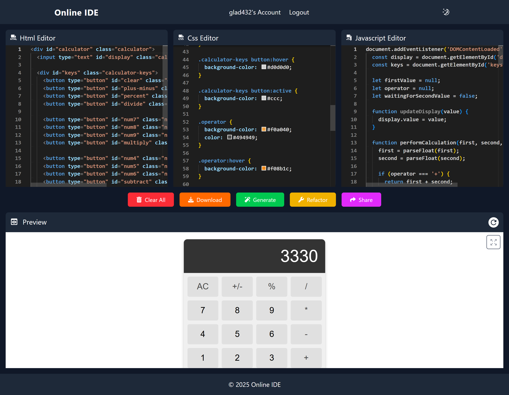

### Python


### JavaScript


### C


### C++
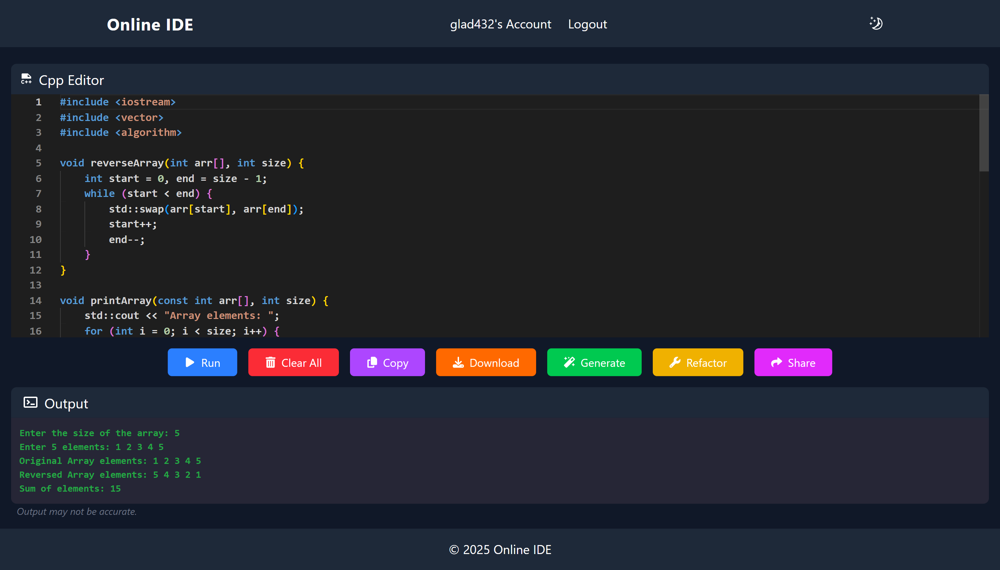

### Java
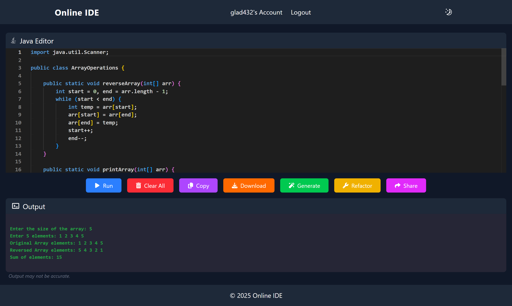

### C#


### Rust
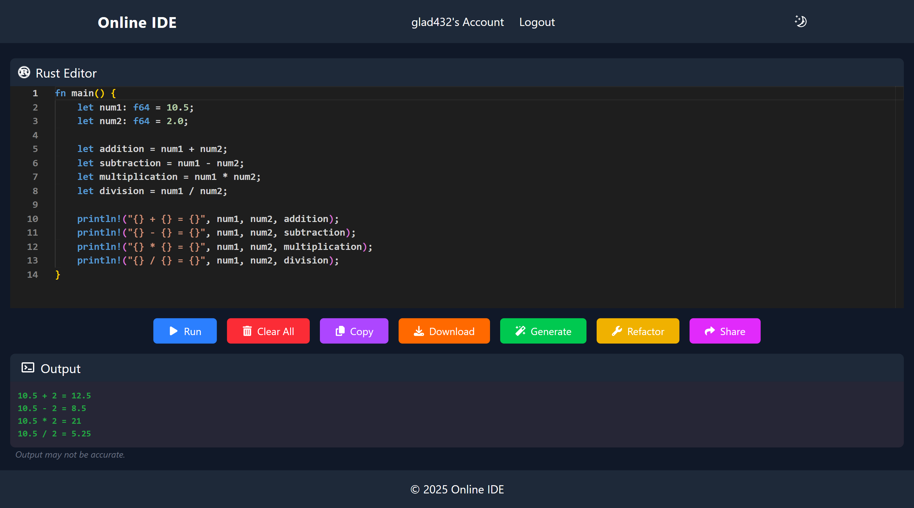

### Go
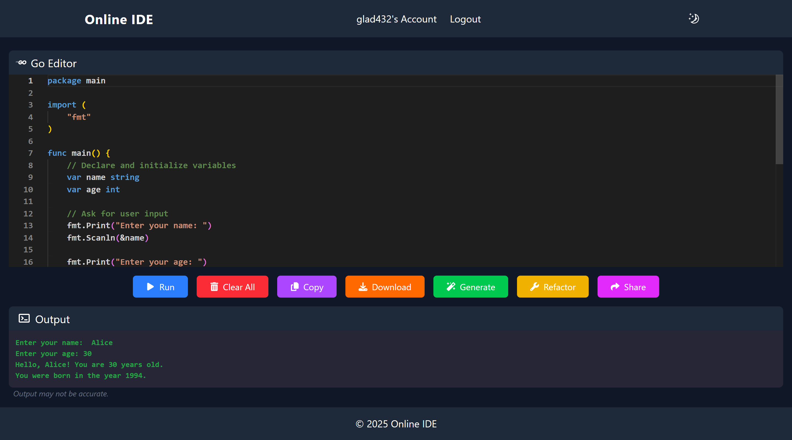

### Verilog
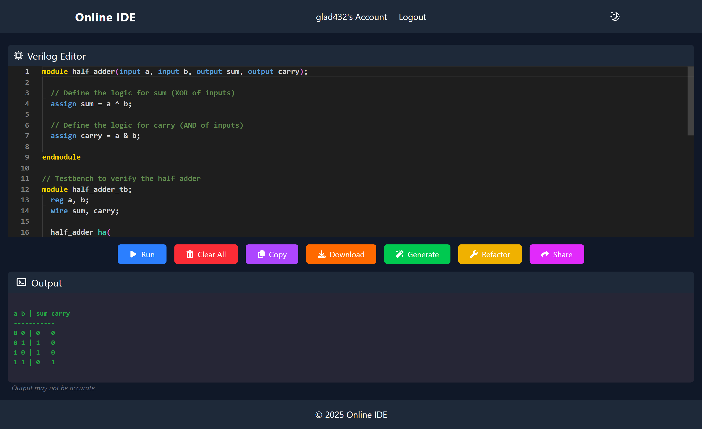

### SQL
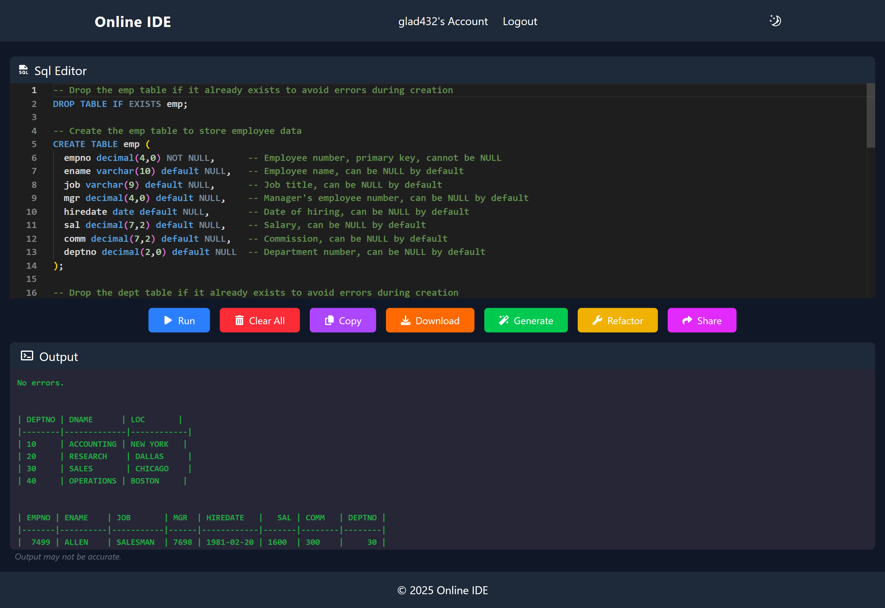

### MongoDB
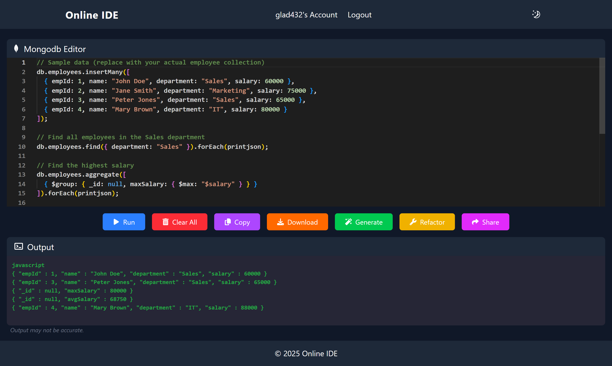

### Swift
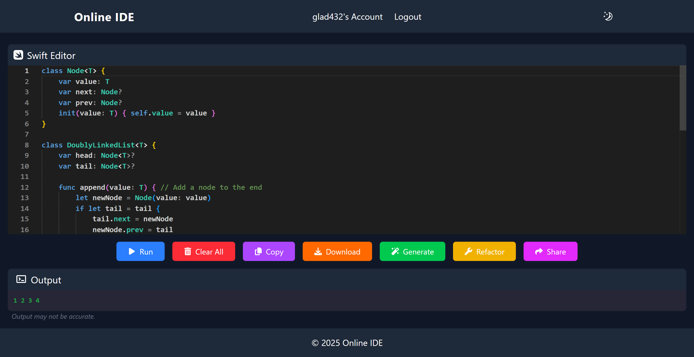

### Typescript
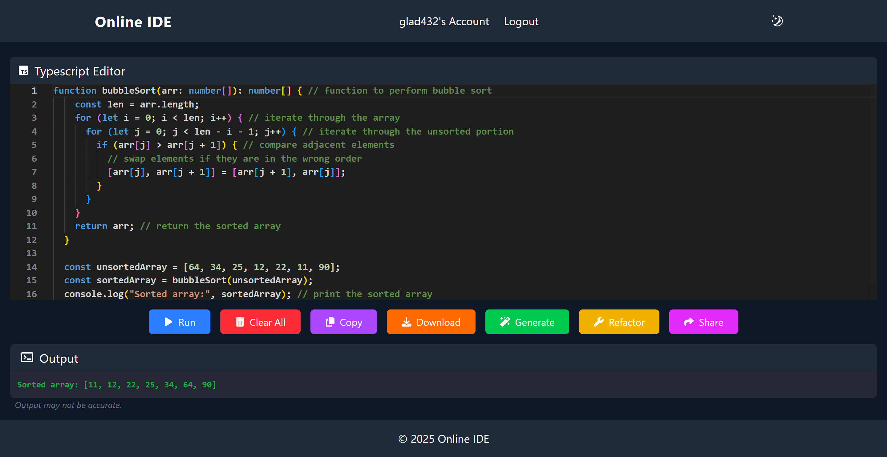

### Dart
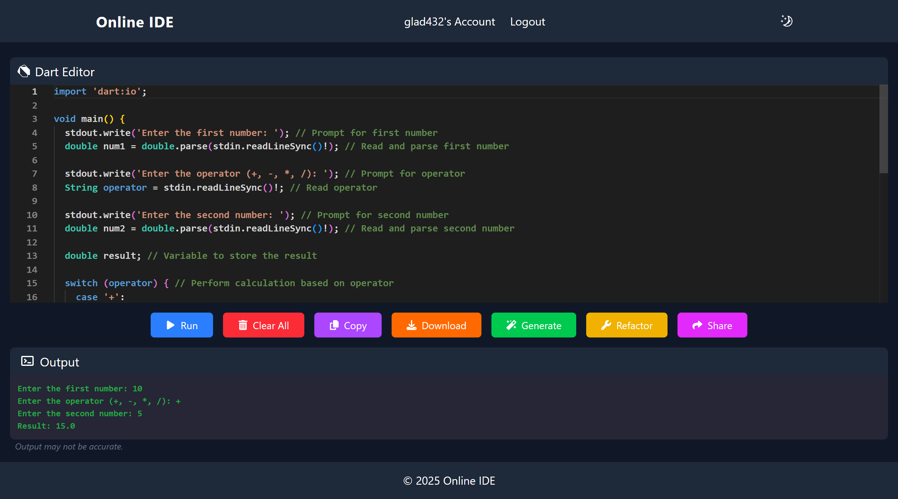

### Kotlin
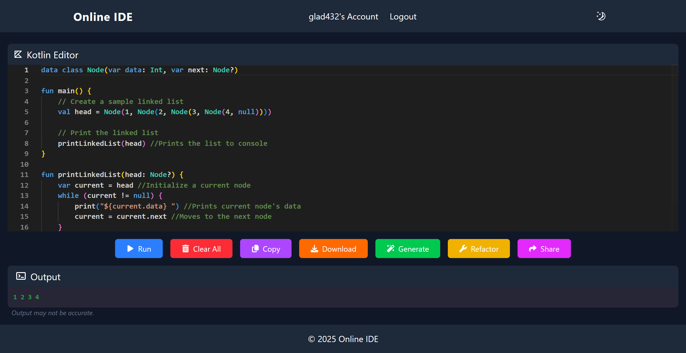

### Perl
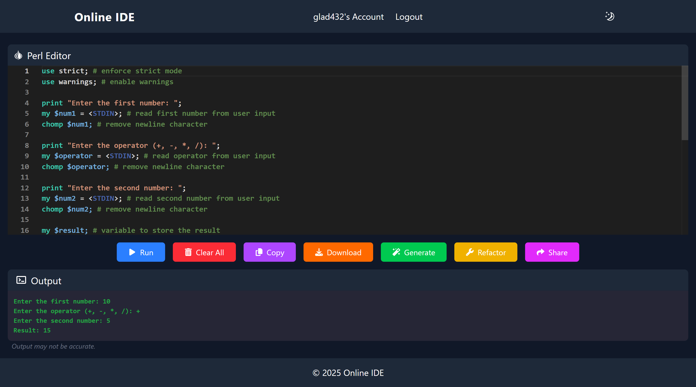

### Scala
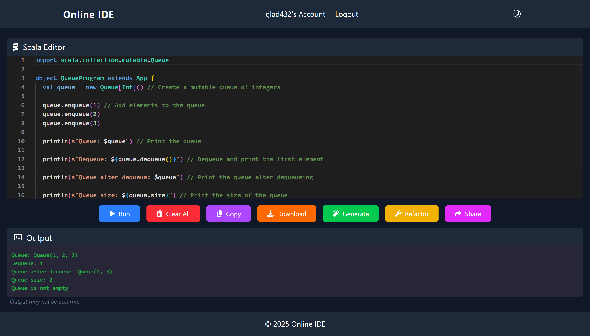

### Julia
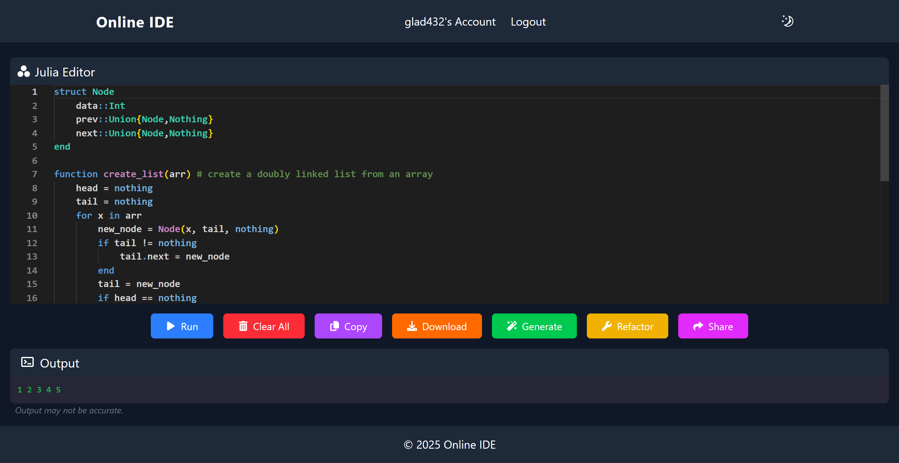

### Accounts
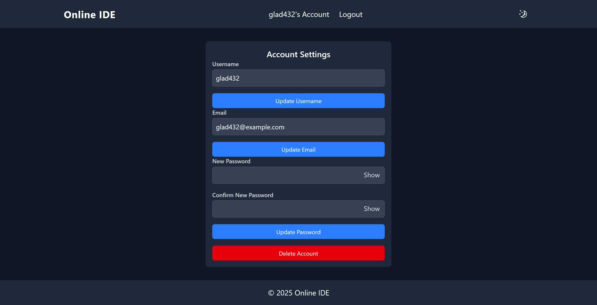

### Login


### Register


## License

You can use this under the MIT License. See [LICENSE](LICENSE) for more details.